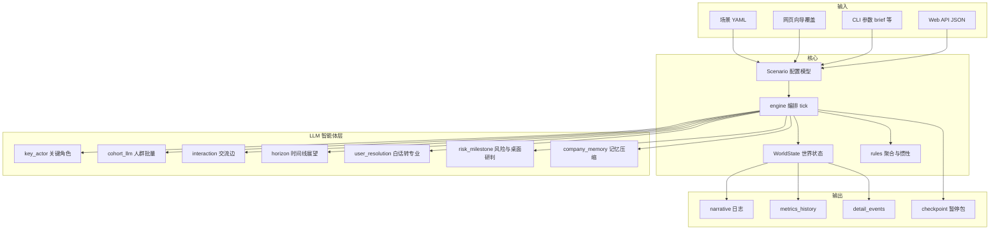

# people 系统说明（架构与机制 · 机构级技术白皮书）

本文档是 **people** 的 **权威技术说明**：设计目标、模块边界、数据流、关键机制、扩展栈与 **已知能力边界**，面向 **政府（各级政策与综合研判）、大型企业 / 集团、中小企业、创业公司** 的 **信息化负责人、业务与风控牵头人、技术架构与研发** 共同阅读。  
**操作步骤**（安装、命令、改 YAML、模型与网页习惯）以 **[操作指南.md](./操作指南.md)** 为准；**一页纸入口**见 **[README.md](./README.md)**。  
**扩展能力**见 **§12**；**验证、校准闭环、敏感性、稳定性（通俗解读）、归因存档与 explain**见 **§13**；**规划摘要**见 **§14**；**蒙特卡洛网页操作**见 **§8.1**；**缺口清单、工程优先级**见 **§16～§17**；**文档索引**见 **§18**；**机构交付与审计**见 **§19**。

**专业表述约定**：文中 **proxy**、**演练生成**、**压力测试** 等用语具有固定含义（见 §1.5、§3）；**不将本系统表述为已通过某类强制性测评或认证**——若部署环境有等保、关基、行业监管或内控要求，须由使用方在 **自有治理框架** 下完成评估与加固。

---

## 1. 系统定位

### 1.1 要解决什么问题

people 是一个 **政策或产品发行动作下的社会 / 市场反响演练框架**：用户在场景中下达「要推什么」（`player_brief`），系统在离散时间步（**tick**，约对应现实 1～2 周量级）内驱动 **海量人群统计 proxy（cohort）**、**具名角色（人设 / 关键智能体）**、**组织内部部门链** 与 **媒体 / 监管 / 交流网络** 的叙事与指标演化，用于：

- 沟通口径与资源分配的压力测试  
- 多主体利害与程序时滞的「情境一致」推演  
- 与脱敏案例摘要（`reference_cases_brief`）对照的机制讨论  

### 1.2 明确不是什么

| 不是 | 说明 |
|------|------|
| 统计预测引擎 | 不输出可校准的股价、销量、选票或案件结果预测；指标为 **proxy**，用于相对比较与叙事约束。 |
| 法务 / 行政决定系统 | LLM 产出为演练生成文本，**不构成**法律意见或真实批复。 |
| 游戏化沙盘 | 提示词与规则刻意 **禁用游戏隐喻**，并约束「全知视角、单轮翻盘、全国一张脸」等不真实写法。 |

### 1.3 两种演练类型（`exercise_type`）

| 值 | 典型使用者 | `player_brief` 含义 | 指标阅读要点 |
|----|------------|---------------------|--------------|
| `policy` | 各级政策与监管相关方 | 措施要点、过渡期、执法与沟通边界等 | `policy_support`：对政策 / 施政的接受度 proxy；`unrest`：动荡 / 对抗强度 proxy |
| `product` | 集团 / 中小企业 / 创业发行方 | 产品形态、定价、渠道、传播与合规等 | 同上字段名中，`policy_support` 在语义上映射为对发行方动作的 **支持 / 好感（含购买意愿 proxy）**；另有 `issuer_trust_proxy`、`supply_chain_stress` 等慢变量 |

行政与地域由 `policy_context`（层级、地名、民风、媒体环境）约束；品牌与体量由 `issuer`（`archetype`、`brand_equity`、`reputation_brief` 等）进入 `decision_context`，供各智能体提示词使用。

### 1.4 面向政府、企业与创业公司的专业定位（非功能清单）

| 组织类型 | 典型用途（决策前「情境一致」推演） | 使用上应强调的治理点 |
|----------|-----------------------------------|----------------------|
| **政府机关与事业单位** | 措施口径、条线与基层执行摩擦、舆情与稳态 **proxy** 的压力测试；与脱敏案例摘要对照讨论机制 | **不替代**法定程序与集体决策；输出为 **演练生成**，对外引用须有人类审核与定级 |
| **大型企业 / 集团** | 产品或重大动作的跨部门叙事、监管与媒体路径、资源与财务 **proxy** 约束下的多轮推演 | 与真实预算、法务、公关定稿 **分离**；宜建立 **场景版本 + 实验清单** 与复盘归档习惯 |
| **中小企业** | 发行节奏、渠道与合规边界的沟通预演；人力与外包协作链（人设与部门链可裁剪） | 控制 **进入模型的文本** 密级；优先 **脱敏** `player_brief` / `reference_cases_brief` |
| **创业公司** | 创始人盯盘、砍范围、外包职能与社群反馈的 **同一套指挥—专业转化—多主体交流** 机制 | 明确 **冷启动品牌** 与 `issuer`、`problem_salience` 的设定责任；避免将 **proxy** 当作融资或估值依据 |

**与「只实现功能」的区别**：机构级使用要求 **可追溯（版本与哈希）、可解释（§4 管道顺序 + §12～§13 溯源链与 `explain`）、可退化（性能预算）** 与 **文档化的能力边界（§16）**——这些与业务功能同等重要，并在本文与代码中 **并列维护**。

### 1.5 责任边界、数据与模型治理（必读）

1. **决策支持，非决定本身**  
   系统产出（叙事、`detail_events`、指标曲线、白话→专业摘要、桌面研判等）均为 **在给定场景假设下的演练生成**，用于沟通、培训与压力测试。**不构成**行政许可、司法意见、投资顾问意见或合同承诺。对外正式发布、对监管报送或对公众承诺，须以 **组织正式流程与真人专业意见** 为准。

2. **输入数据的分类与出境**  
   `player_brief`、`reference_cases_brief`、处置文本、场景 YAML 及 **经由 LLM 提供商传输的内容** 均可能离开本机。**涉密、个人信息、未公开商业条款** 须按使用方 **保密制度** 事先脱敏或改用 **内网自托管模型与网关**；本项目 **不内置** 数据分级标签与 DLP，由部署环境承担。

3. **可审计工件与局限**  
   **已实现**：`experiment_manifest`（见 `people/experiment_manifest.py`）、`metrics_history`、`narrative`、`tick_end.attribution_tick`（摘要）、**`attribution_log`（按环节、按智能体拆解，见 §12）**；**`run --dump-full-state` + `explain`** 可导出「用人话」总览（§13.5）。SSE / 暂停包中含 **experiment_manifest** 副本。**局限**：checkpoint 默认 **进程内**、重启即失；**非**不可篡改审计日志；**单条 LLM JSON 内每个字段级** 的细链与统一 correlation_id 仍见 §16.4 缺口。

4. **用语与对外沟通**  
   对内汇报建议统一使用 **「演练 / 情景推演 / proxy」**，避免将曲线描述为 **实测统计或必然发生的未来**。产品界面与对外材料中，宜保留 **「演练生成」** 或等效提示，与 §1.2 定位一致。

---

## 2. 总体架构



- **配置**：`Scenario`（Pydantic）由 YAML 反序列化；网页请求可在 **不落盘** 情况下合并 **场景补丁**（见 `people/scenario_overrides.py` 与 `webapp.RunRequest` 可选字段）。  
- **状态**：`WorldState` 保存 tick、宏观标量、cohort 列表、叙事、细节事件、展望、指挥台笔记、公司记忆、决策层摘要等。  
- **编排**：`engine.run_single_simulation` 按 tick 调用 roster → 各 agent → 规则聚合 → 可选展望 / 交流 / 记忆；遇危机或里程碑则 **暂停** 并生成可序列化的 **checkpoint**。

---

## 3. 核心概念词典

| 概念 | 含义 |
|------|------|
| **tick** | 离散时间步；单轮内顺序调用本 tick 被选中的智能体，再合并其对指标的 **delta**。 |
| **cohort** | 人群桶：权重、态度、激活度、`class_layer`（基层/中产/高层 proxy）与 traits；宏观指标常由 cohort **聚合**而来。 |
| **key_actors** | 兼容模式：列表中 **每人每 tick** 调 PRIMARY（成本高，适合少量角色）。 |
| **personas** | 人设名册：可 80+；通过 `llm_each_tick`、池化抽样 `pooled_llm_calls_per_tick`、`always_sample_ids`、**triggers** 与 `markets` / `product_kinds` 过滤控制登场频率。 |
| **decision_context** | 每 tick 注入 LLM 的 JSON：政策上下文、issuer、可选机构与合作、财务池、`company_memory_synthesis`、**决策层** `decision_layer_directive` 等（见 `context.build_decision_context` + `augment_decision_context`）。 |
| **crisis_rules** | 当 tick 末指标满足 AND 条件时 **暂停**，要求用户输入处置方案；`crisis.py` 负责选题与暂停包文案。 |
| **risk_milestone_primary_calls** | 可选：累计 PRIMARY 调用达阈值后暂停并做 **内部风险盘点**（与危机规则独立）。 |
| **checkpoint** | 内存快照（pickle）：`scenario_dict`、`state_dict`、`rng_state`、`pause_kind` 等；**进程重启即失效**。 |
| **desk_review** | 用户提交方案后经「白话→专业转化」+「桌面可行性」研判；若 `confirm_after_desk_feasibility: true`，需再次 **确认** 才继续 tick。 |
| **决策层** | 用户确认方案后写入 `decision_layer_active_summary`，并通过 `decision_layer_directive` 持续影响后续 tick 的智能体上下文。 |
| **realism** | `RealismConfig`：环境漂移、惯性、对 LLM delta 的缩放与硬顶等，减轻单轮极端波动。 |
| **REALISM_SOCIAL_LAYER** | `agents/realism_layer.py` 中跨智能体复用的长提示片段：组织利害、政策—市场传导、语态禁令等，拼入多类 system prompt。 |
| **演练生成** | 凡经本引擎与 LLM 产生的叙事、指标轨迹、研判摘要等，均视为 **情景推演产物**，用于内部分析与培训；**非**未经标注即可对外等同于事实或批复的结论（见 §1.5）。 |
| **experiment_manifest** | 单次运行的 **可复现摘要**：场景内容哈希、语义版本、插件开关与顺序、`performance_budget`、`model_slots`、seed 等；见于 **`run_start`** 与 **`pause_package`**（实现见 `people/experiment_manifest.py`）。 |
| **PEOPLE_SCENARIO_SCHEMA_VERSION** | 代码侧场景模型 **主版本号**（`people/config.py`）；与 YAML 可选字段 **`scenario_schema_version`** 一并写入清单，用于 drift 分析。 |
| **`dump-full-state` 存档** | CLI `run --dump-full-state` 写出 JSON：`scenario_dict`、`state_dict`、预生成的 **「用人话_结果怎么来的」**；供 **`explain`** 解读（§13.5）。 |
| **`用人话说`（ensemble）** | `summarize_ensemble` 返回字段：通俗说明 **波动大小、哪项指标抖得明显、哪种种子最好/最差**（`stability_report.py`）。 |
| **`标准输出_决策简报`（ensemble）** | 同一次 `summarize_ensemble` 内嵌：主路径 / 高风险路径 / 触发与脆弱点 / **P×影响×不可逆** 风险表 / 尾部分位摘要 / **分歧分析** / 多模型偏见提示（`risk_ensemble_report.py`）。 |
| **`ensemble_risk`** | 场景 YAML 可选块：控制风险简报阈值与 **impact / irreversibility** 权重（`EnsembleRiskSpec`，默认内置）。 |
| **`macro_inertia_blend`** | `realism` 下 0～0.95，**默认 0**。大于 0 时回合末将宏观量向 **上一轮末曲线** 回拉，增强 **惯性**（§6.1）。 |
| **`decision_support`** | 场景顶层；默认 **`enabled: true`**。控制 **序列粗检** 是否生成及阈值覆盖（§6.1）。 |
| **`regional_grounding`** | 模拟前 **多轮地区情境「检索」**（可选 **中文维基 REST 摘要**、可选 **开放网页检索摘要** + **快模型**合成）：先形成「**地方既有执行环境 / 中央上位框架 / 基层或商户常态**」摘要，再把 **`player_brief`** 明确为 **新政策或新动作** 叠加上去；结构化副本注入 **`decision_context.regional_grounding`**（`people/regional_grounding.py`，网页抓取逻辑见 **`web_search_context.py`**）。**非**官方法规库检索，不得作合规依据。 |

### 3.1 内置组织与部门节点（`actor_id` 一览）

下列 ID 在 **`people/engine.py`** 的 `_actor_label` 中有**固定中文显示名**，并作为 **`people/agents/interaction.py`** 里三条「部门交流基线链」的节点，供 **交流网络图** 与 **LLM 生成沟通边** 时对齐「谁在和谁说话」。  

**不在此表的 ID**：场景 YAML 里 **`personas` / `key_actors` / `cohorts`** 的 `id` 由你自定义（如 `regulator_xxx`、`urban_youth`）；引擎对 **cohort** 会显示为「用户群体（…）」；其余未知 `id` 在图上可能直接显示英文 id。

**特殊规则**

- `issuer_command_center`：当 `issuer.archetype == startup` 时，标签为 **「创业公司指挥中心（创始人/核心团队）」**，否则为 **「集团/产品指挥中心」**。  
- 任意节点 id 可带后缀 **`_editorial_desk`**（如媒体侧），显示为 **「〈原节点名〉编辑台」**。

---

#### 指挥中枢与管理层级

| `actor_id` | 界面/叙事中的名称 |
|------------|-------------------|
| `issuer_command_center` | 集团/产品指挥中心（创业时为「创业公司指挥中心…」） |
| `policy_command_center` | 政策指挥中心 |
| `executive_steering_committee` | 高层决策委员会 |
| `department_manager_office` | 中层管理办公室 |
| `frontline_execution_team` | 基层执行团队 |

#### 用户代表（组织化用户侧）

| `actor_id` | 名称 |
|------------|------|
| `user_frontline` | 基层用户代表 |
| `user_middle_group` | 中层用户/组织客户 |
| `user_upper_group` | 高层用户代表 |

#### 产品侧 · 集团职能部门（与 `PRODUCT_DEPARTMENT_CHAIN` 一致）

单条链路的箭头表示引擎里**基线交流**的常见上下游（括号内为链上说明摘要，完整见 `interaction.py`）。

| `actor_id` | 名称 |
|------------|------|
| `customer_service_center` | 客户服务中心 |
| `public_opinion_ops` | 舆情运营中心 |
| `brand_pr_center` | 品牌公关中心 |
| `legal_compliance_center` | 法务合规中心 |
| `government_affairs_center` | 政府事务中心 |
| `regulatory_liaison_window` | 监管联络窗口 |
| `supply_chain_control_tower` | 供应链控制塔 |
| `operations_planning_center` | 运营计划中心 |
| `sales_channel_mgmt` | 销售渠道管理部 |
| `finance_treasury_center` | 财务与资金中心 |

**产品链路线性顺序（节选）**

1. 客服 → 舆情 → 公关 → 法务 → 政务 → 监管联络 → **高层委员会**  
2. 供应链控制塔 → 运营计划 → 渠道 → **高层委员会**  
3. 财务资金 → **高层委员会**  

#### 政策侧 · 县域与乡镇条线（与 `POLICY_DEPARTMENT_CHAIN` 一致）

| `actor_id` | 名称 |
|------------|------|
| `township_frontline_team` | 乡镇基层执行组 |
| `county_policy_office` | 县级政策办公室 |
| `county_data_bureau_office` | 县政务数据局 |
| `county_justice_bureau` | 县司法局 |
| `county_public_security` | 县公安条线 |
| `county_emergency_bureau` | 县应急管理局 |
| `county_finance_bureau` | 县财政局 |
| `county_market_regulation` | 县市场监管局 |
| `county_cyberspace_office` | 县网信条线 |
| `county_convergence_media` | 县融媒体中心 |
| `county_petitions_office` | 县信访办 |
| `municipal_supervision_group` | 市级督导组 |

**政策链路线性顺序（节选）**：乡镇 → 县政策办 ↔ 数据局 → 司法 → 公安 → 应急；财政 ↔ 政策办；市监、网信 ↔ 融媒体；信访 → 政策办；政策办 → 市级督导组。

#### 创业公司精简架构（与 `STARTUP_DEPARTMENT_CHAIN` 一致）

| `actor_id` | 名称 |
|------------|------|
| `customer_voice_channel` | 早期用户与社群反馈通道 |
| `founder_ceo` | 创始人/CEO |
| `core_build_team` | 产品技术核心小队 |
| `lean_growth_ops` | 增长与运营（精简） |
| `fractional_cfo_advisor` | 兼职/外包财务顾问 |
| `external_counsel_pool` | 外包律师池 |
| `community_ops_volunteer` | 社群志愿者运营 |
| `external_pr_advisor` | 外聘公关顾问 |

**创业链路线性顺序（节选）**：用户声音通道 ↔ 创始人；创始人 ↔ 技术核心 ↔ 增长运营 ↔ 兼职财务 ↔ 创始人；创始人 ↔ 外包律师；志愿者社群 ↔ 用户通道；外聘 PR ↔ 增长运营。

---

## 4. 单 tick 引擎顺序（逻辑概要）

以下顺序为阅读源码时的「主线」（具体以 `people/engine.py` 为准，略去分支与可选模块）：

1. **tick 自增**（续跑入口可能先处理 `resume`：确认 / 提交方案 / 改评）。  
2. **扩展钩子 `tick_start`**：`extension_stack.run_extension_plugins`，如 **延迟** `delay` 冲刷 `WorldState.delayed_events`。  
3. 构建 **`decision_context`** 并注入 **指挥台笔记**、**公司记忆**、**决策层**。  
4. **环境漂移**（`apply_environment_drift`）。  
5. **roster**：`agents_for_tick` 得到本 tick 的 `ResolvedAgent` 列表及触发的 `triggers`。  
6. 各关键智能体：**`run_key_actor_turn`**（PRIMARY）→ 按人逐个 **`apply_key_actor_effect_one`**（`rules.py` 缩放与合并，并 **逐人写入 `attribution_log`**）。  
7. 可选：**cohort_llm**（FAST）→ **`apply_cohort_deltas`**。  
8. **扩展钩子 `after_cohort_llm`**（如 **behavior_micro**）。  
9. 可选：**merge_company_memory_tick**（FAST）。  
10. 可选：**run_social_interactions**（FAST）；可扣 **`operational_finance`** 与 **`extensions.resources`**。  
11. **扩展钩子 `after_interactions`**（资源池等，视插件而定）。  
12. **`aggregate_from_cohorts`**、**`_apply_operating_ledger`**（与此前各步对宏观 / 财务的变动写入 **`attribution_log`**，见 §12）。  
13. **扩展钩子 `pre_finalize`**：**因果**（维护 **`causal_metrics_this_tick`**）、**扩散**、**锚定**、**KPI**、**资源**等（顺序见 `Scenario.extensions.plugin_order`）。  
14. **因果治理审计**（若 `extensions.causal.governance_mode` 开启）：全部 **`pre_finalize` 结束后**、下文粘性混合与 **`finalize_tick` 前** 执行 **`people/causal_audit.run_causal_governance_audit`**（§12）。  
15. **宏观粘性混合**（若 **`realism.macro_inertia_blend` > 0**）：`rules.apply_macro_inertia_blend` 将宏观七项（或 `macro_inertia_keys` 指定子集）向 **`metrics_history` 末行**（上一轮末快照）线性回拉，写入 **`attribution_log`（`macro_inertia_blend`）**；用于曲线更接近「民调/舆论惯性」，**非**实证标定默认值（默认 0，见 §6.1）。  
16. **`finalize_tick`** → **`metrics_history`**。  
17. **扩展钩子 `after_finalize`**：`rl_stub` / `multimodal_stub` 等占位。  
18. 可选：**run_horizon_forecast**（FAST）及 **`_append_synthetic_details`**。  
19. **SSE `tick_end`**：除指标与归因摘要外，若 **`decision_support.enabled`**（默认开），可附带 **`decision_support`** 通俗粗检（单轮跳变、少见共变，见 §6.1）。  
20. 检查 **crisis_rules** / **risk_milestone** → 可能 **return** 并附带 `pause_package`。  

---

## 5. LLM 模块一览

| 模块 | 文件 | 典型模型 | 作用 |
|------|------|----------|------|
| 关键角色回合 | `agents/key_actor.py` | PRIMARY | 每角色 JSON：公开陈述、对指标与 cohort 的 delta、媒体报道碎片等。 |
| 人群批量 | `agents/cohort_llm.py` | FAST | 对各 cohort 的态度 / 激活度增量（受 `GROUNDING` + realism 约束）。 |
| 交流网络 | `agents/interaction.py` | FAST | 生成「谁联系谁、渠道、摘要、可选成本」等边，供图与叙事。 |
| 时间线展望 | `agents/horizon.py` | FAST | `today` / `next_month` / `next_year` 等条件句展望（非单一结局）。 |
| 白话处置 | `agents/user_resolution.py` | FAST | 指挥台口语 → 专业执行摘要 + **阶段周期（演练估计）** 等。 |
| 风险台账 / 桌面研判 | `agents/risk_milestone.py` | FAST | 内部风险条目；桌面 `go/conditional/no_go` + **桌面侧时间线估计**。 |
| 公司记忆 | `agents/company_memory.py` | FAST | 将多段公开陈述压缩为 `company_memory_synthesis`。 |
| 写实提示层 | `agents/realism_layer.py` | — | 字符串常量，被拼入上述多处 system prompt。 |

无 API Key 时走 **`providers/dry_run.py`**：返回合法 JSON 占位结构，便于联调 UI 与流程。

### 5.0 多厂商密钥与路由（`people/providers/registry.py`）

| 路由前缀 | 环境变量 | 说明 |
|----------|----------|------|
| **`openai:`** | `OPENAI_API_KEY`；可选 `OPENAI_BASE_URL` | OpenAI 官方 **Chat 补全 API**（与网页版 ChatGPT 密钥体系不同）、或 DeepSeek / Azure 等 **OpenAI 兼容**网关。 |
| **`anthropic:`** | `ANTHROPIC_API_KEY` | Claude（Anthropic Console）。 |
| **`google:`** / **`gemini:`** | `GOOGLE_API_KEY` 或 `GEMINI_API_KEY`（二选一） | Gemini（Google AI Studio）。 |

**`PEOPLE_MODEL_PRIMARY` / `PEOPLE_MODEL_FAST`** 取值为 **`前缀:模型名`**（如 `openai:gpt-4o`、`google:gemini-2.0-flash`）。根目录 **`配置示例-OpenAI-ChatGPT.cmd`**、**`配置示例-Gemini.cmd`**、**`配置示例-Claude.cmd`**、**`配置示例-DeepSeek.cmd`** 与 **`.env.example`** 供终端一键 `set`；用户向说明见 **README.md**、**操作指南.md**。

### 5.1 地区情境检索（`regional_grounding`）

- **何时开**：场景 YAML 顶层 **`regional_grounding.enabled: true`**，或 CLI **`--regional-grounding` / `--region …`**（见 **`main.py` `add_regional_grounding_args`**），或 Web 请求体中与 **`ScenarioOverridePayload`** 对齐的字段（**`regional_grounding_enabled`**、**`regional_grounding_region`** 等）。  
- **流程**：在 **`run_single_simulation`** 建 **`WorldState` 之前** 执行 **`apply_regional_grounding`**：默认 **3 轮** 快模型 JSON（**`policy`**：地方既有政策 → 中央衔接 → 基层 baseline；**`product`**：地方商事/食安城管等 → 国家通用监管框架 → 中央政策地方落地摩擦）。**`mode: wikipedia_then_llm`** 时，对 **`region_label`**（或 **`policy_context.jurisdiction_name`**）尝试 **维基摘要** 片段，仅喂给第 1 轮作弱先验（可能失败或偏题）。  
- **开放网页检索（可选）**：**`regional_grounding.web_search_enabled: true`**（或 CLI **`--web-search`** / **`--web-search-provider`**，或 HTTP **`regional_grounding_web_search`**）时，在快模型第 1 轮前按地区与 **`player_brief` 片段**自动生成 **1～2 条查询**，调用 **DuckDuckGo**（依赖 **`duckduckgo-search`**）或 **Brave Search API**（环境变量 **`BRAVE_API_KEY`** 或 **`PEOPLE_BRAVE_API_KEY`**；可用 **`PEOPLE_WEB_SEARCH_PROVIDER`** 覆盖默认 **`web_search_provider`**）。返回 **标题 + URL + 摘要 snippet**，**非全文**、**非**法规库；**与维基相同**，仅注入 **地方向** 两轮 pass（`local_existing` / `local_commercial`）。复盘见 **`regional_grounding_artifact.web_search`**。智能体在 **tick 内**仍无「再搜一次」的工具调用；若需每 tick 联网，须另扩架构。  
- **国内网络与 LLM**：DuckDuckGo 线路在**中国大陆公网**上**常不稳定或不可用**（与是否使用 **DeepSeek** 等 OpenAI 兼容 **LLM API** 无关——后者只负责生成文本，不提供网页检索）。国内部署建议 **`web_search_provider: brave`** 并配置 **`BRAVE_API_KEY`**，或自行接入可访问的搜索/代理；失败时 grounding 仍可走 **维基 + 快模型**或 **`llm_only`**。  
- **写入**：合成块 **prepend** 到 **`player_brief`**，并附标题 **「指挥台·本轮新动作/新政策」**；**`policy_context.local_norms_brief`** 追加「基层须在旧常态上叠增量」说明；**`WorldState.regional_grounding_trace` / `regional_grounding_artifact`** 供复盘；**`augment_decision_context`** 把 **`regional_grounding`** 并入各智能体 JSON。  
- **商户体量**：**`business_scale`**（`street_shop` … `national_group`）可选 **`sync_issuer_archetype_from_scale: true`**（默认）自动对齐 **`issuer.archetype`**。  
- **并行 ensemble**：父进程 **`prebake_regional_grounding_for_ensemble`** 只跑 **一轮** grounding 后 **关闭 enabled**，避免每 worker 重复 3 次调用（CLI **`ensemble` / `stability`** 与 **`POST /api/ensemble`** 已接线）。  
- **示例场景**：**`scenarios/regional_hotpot_chengdu.yaml`**（社区火锅店 + 成都情境）。

---

## 6. 规则层（`people/rules.py`）在做什么

- 将 cohort 态度 / 激活度 **聚合**到宏观情绪、谣言、动荡等（含 `class_layer` 权重）。  
- 对 LLM 给出的 delta 做 **缩放、硬顶、与惯性结合**，使指标变化更像「短周期边际」而非桌游暴击。  
- **finalize_tick** 等函数在 tick 末统一刷新历史曲线可用快照。  

具体参数由场景中的 **`realism`** 与 `operational_finance` 等共同影响（见 YAML 与 `config.RealismConfig`）。

### 6.1 决策辅助与「更像真实曲线」的可选旋钮

| 机制 | 配置 | 作用与诚实边界 |
|------|------|----------------|
| **宏观粘性混合** | `realism.macro_inertia_blend`（0～0.95，**默认 0**）、`realism.macro_inertia_keys`（空=七项全生效） | 每轮末在 **finalize 前** 把宏观量向 **上一轮末快照** 回拉一部分，减轻「单轮智能体把曲线打飞」；**不**声称对应某国真实民调参数，需自行试参或与 **calibrate**（§13）对照真值。 |
| **决策辅助粗检** | 顶层 **`decision_support`**：`enabled`（默认 **true**）、`jump_warn_threshold`（按指标覆盖默认阈值） | **`people/decision_support.py`**：对比相邻两轮 `metrics_history`，对 **单轮跳变过大**、**谣言与支持度同升**、**动荡升而谣言几乎不动** 等输出 **通俗提醒**；仅为 **规则启发**，**不能**代替业务判断。关闭：`decision_support.enabled: false`。 |

**存档**：`run --dump-full-state` 含 **`决策辅助_粗检`**（全程最陡跳跃 + 末轮提示）；**`explain`** 在提供 `scenario_dict` 时会合并该块。

### 6.2 经营台账、税费、债务与手工调账（`operational_finance` + `finance_ledger`）

| 能力 | 配置 / 入口 | 说明 |
|------|-------------|------|
| **按行业×体量缩放运营现金消耗** | `industry_operating_cost_multiplier`、`auto_scale_operating_cost_from_issuer` | 在 **`operating_cost_million_per_tick`** 上乘算；`auto_scale` 时按 **`issuer.archetype`**（小店/创业更轻、集团更重）。 |
| **写意营收与税负（产品）** | `revenue_proxy_million_per_tick`、`effective_tax_rate_on_revenue` | 每 tick 从 **现金**扣 **税**（百万 proxy）；非真实申报模型。 |
| **企业缴税 → 地方财力 proxy** | `track_parallel_fiscal_pool`、`parallel_fiscal_pool_initial_billion`、`company_tax_mirror_to_fiscal_fraction` | 产品演练可同时跟踪 **十亿 proxy 财力池**：税中按比例 **入库**（与真实分成无关，仅供叙事压力测试）。 |
| **债务本息** | `debt_principal_million`、`debt_interest_annual_rate_proxy`、`debt_principal_repay_million_per_tick` | 状态 **`debt_balance_million`**；利息按 **~26 tick/年** 写意摊销；本金按 tick 偿还。 |
| **政府税收入库（政策）** | `fiscal_tax_inflow_from_economy_billion_per_tick` | **财力池** 每 tick 增加 **系数 × `economy_index`**（写意）；仍扣 **`policy_spend_per_tick_billion`**。 |
| **智能体决策带出金流** | `key_actor` JSON **`cash_delta_million`** / **`fiscal_delta_billion`** | 交流边 **`cost_million` / `fiscal_billion`** 仍会扣款（既有逻辑）。 |
| **暂停时手工改账** | **`POST /api/finance/adjust-checkpoint`**；网页暂停弹窗内 **「财务手工调账」** | **`copy_checkpoint`** 复制快照 → 改 **`state_dict`** 内现金/财力/债务 → **`put_checkpoint`** 返回 **新 token**（旧 token 仍有效直至被消费，建议只用最新）。 |

实现：**`people/finance_ledger.py`**；引擎在 **`operating_ledger`** 归因步调用；**`metrics_history`** 含 **`debt_balance_million`**（若跟踪）。示例：**`scenarios/regional_hotpot_chengdu.yaml`**（小店+税+债+并行财力）、**`scenarios/policy_county_example.yaml`**（县级财力+经济挂钩税入）。

---

## 7. 配置从哪里来

### 7.1 YAML 场景文件（权威底稿）

路径：`scenarios/*.yaml`。包含 ticks、cohorts、personas、crisis_rules、institutions、cooperations、`realism`、`cohort_llm`、**`decision_support`**、**`performance`** 等。**人设池、危机条件、财务开关**等复杂结构 **以 YAML 为准**。若需 **更钝的宏观曲线**，可在 `realism` 下试 **`macro_inertia_blend`**（§6.1）；若汇报材料 **不需要** 粗检文案，可设 **`decision_support.enabled: false`**。

### 7.2 网页「场景配置向导」与 API 覆盖

在 **不写回磁盘** 的前提下，HTTP 请求可携带可选字段覆盖例如：`exercise_type`、`issuer_archetype`、`brand_equity`、`policy_context` 各子字段、`ticks`、`problem_salience`、顶层 `brief`（即 `player_brief`）。  
合并逻辑：**`people/scenario_overrides.merge_scenario_overrides`**；请求模型见 **`webapp.RunRequest`** / **`PlanEvaluateRequest`**。

### 7.3 命令行

`main.py` 支持 `--brief`、`--brief-file`、`--reference-file`、`--exercise` 等（见 `scenario_from_args`），与网页向导互补。  
**验证 / 校准 / 稳定性 / 归因解读** 子命令与参数见 **§13**（`validate`、`calibrate`、`sensitivity`、`ensemble`、`stability`、`explain`；`run` 的 `--dump-full-state`）。

---

## 8. Web 服务与 API（摘要）

启动：`python -m uvicorn people.webapp:app --host 127.0.0.1 --port 8770`（或 `run_web.cmd`）。

| 方法路径 | 作用 |
|----------|------|
| `GET /` | 返回 `web/index.html` 单页演练台。 |
| `GET /api/scenarios` | 列出 `scenarios/*.yaml` 文件名。 |
| `POST /api/run` | 非流式单次运行；返回终态指标、叙事、细节；若暂停则含 `checkpoint_token`。 |
| `POST /api/run/stream` | **SSE** 流式：逐事件推送 tick / LLM / 交流 / 暂停等。 |
| `POST /api/run/resume/stream` | 用 `checkpoint_token` 续跑：提交方案、桌面改评、或 `confirm_proceed`。 |
| `POST /api/plan/evaluate` | **不推进 tick**：对白板方案做专业转化 + 桌面研判；**无** `checkpoint_token` 时用场景初态（tick 0）+ `player_brief`，**随时可调用**；传 token 则绑定未消费快照。`build_decision_context` + `augment_decision_context` 后注入 **`plan_evaluate_live_context`**（`context.py`）：实盘宏观、资金/财力/债务、资源池、cohort 快照、叙事尾等，供模型**统筹**后再判可执行性与 **`resource_*` 粗估**（见 `user_resolution.py` / `risk_milestone.py`）。 |
| `POST /api/finance/adjust-checkpoint` | **暂停态**：`set_cash_balance_million` / `set_fiscal_remaining_billion` / `set_debt_balance_million` / `note` 改写 checkpoint 内财务字段，返回 **新 `checkpoint_token`**（§6.2）。 |
| `POST /api/ensemble` | 并行多次完整演练（蒙特卡洛）；请求体继承 `RunRequest` 并含 `runs`、`workers`、`threshold_key`、`threshold`；返回 `summary.distributions`（含尾部分位与 std/cv）、`用人话说`、`标准输出_决策简报` 与各 `runs`。 |

单页 `index.html`：宏观/扩展双曲线、流式 tick 更新；交流网络图（vis-network，边合并）；**蒙特卡洛**操作说明见本节 **§8.1**。

Checkpoint 存储：**内存** `pause_store`（`take_checkpoint` 消费，`copy_checkpoint` 只读复制）。

### 8.1 蒙特卡洛 / 终局分布：怎么操作

**它在做什么**：在**同一场景**下，用**不同随机种子**（`seed`, `seed+1`, …）各跑一遍**从头到尾的完整演练**（与单次「开始运行」同引擎，**不是**流式 SSE 那条链路）。跑完后汇总每条 run 的**终局指标**，得到**经验分布**：**均值、标准差、变异系数（cv）**、**分位数（p01/p05/p10/p50/p90/p95/p99）**、最小/最大，以及你指定的一个**阈值问题**：例如「终局 `policy_support` ≥ 0.55 的频率」→ `summary.p_estimate`。  

**决策向输出（勿只盯「哪种结果最多」）**：`summary` 另含 **`标准输出_决策简报`**（主路径 / 最坏样本 / 尾部 P95·P99 摘要 / **risk_score = P×影响×不可逆** 事件表 / 分歧最大的终局指标与两两相关 / 多模型≠更真实的说明）。阈值与权重可在场景 **`ensemble_risk:`** 下覆盖。

**网页（推荐）**

1. 与左侧卡片一致：选好 **场景 YAML**、**随机种子**、**指挥台要点**、**模型与 Key**（与流式运行相同；向导覆盖同样生效）。  
2. 下拉到 **「蒙特卡洛 / 终局分布」** 卡片。  
3. 填写 **并行次数 `runs`**（例如 8～32）、**`workers`**（进程数，建议不超过本机逻辑核心数）。  
4. **阈值指标** `threshold_key`：填 `metrics_history` 里出现的键名，常用 `policy_support`。  
5. **阈值** `threshold`：如 `0.55`。  
6. 点击 **「估计终局分布」**。等待期间页面会进入「运行中」（与流式跑共用部分禁用逻辑）；完成后下方出现 **JSON 摘要** 与 **分位数柱状图**。

**与左侧的关系**：请求体在 **`RunRequest` 基础上增加 `runs`、`workers`、`threshold_key`、`threshold`**，故与左侧 **同场景、同 seed、同 brief、同 Key** —— 仅多跑 N 次完整仿真。

**CPU 与 workers**：`workers` 为 `ProcessPoolExecutor` 并发进程数；`runs` 很大时会占满 CPU。可先 **`runs` 小、`workers` 小**试跑，再放大。

**命令行**

```bash
python main.py ensemble --scenario scenarios/default.yaml --runs 16 --workers 4 --seed 42 --threshold-key policy_support --threshold 0.55 --dump-json out.json
```

`out.json` 含每次 run 的 `final_metrics` 与 `summary`（含 **`distributions`**：p01～p99、std、cv）。`summary` 另含 **`用人话说`** 与 **`标准输出_决策简报`**（风险表、尾部、极端 seed 样本、分歧分析等）；CLI **`stability` / `ensemble`** 会额外打印简报 JSON（实现：**`summarize_ensemble`** → **`stability_report`** + **`risk_ensemble_report`**）。

**与 §13 的关系**：网页蒙特卡洛侧重 **分位数与图表**；**自动校准、敏感性扫描、归因存档 explain** 目前以 **CLI（§13）** 为主。

---

## 9. 指挥台与决策层数据流

1. 用户于暂停或风险里程碑处提交 **白话方案** → 引擎调用 **user_resolution** + **risk_milestone（desk）**。  
2. 若开启确认门闩 → 进入 **`desk_review`**，前端展示多套方案的 **可执行性** 与 **阶段周期（转化 / 桌面）**；可 **改评** 或 **确认继续**。  
3. **确认**后：`decision_layer_active_summary` 更新，后续 tick 的 `augment_decision_context` 注入 **`decision_layer_directive`**，使机关 / 公司内部推演与已确认指令对齐。  
4. **`decision_layer_history`** 保留历史方案条目（含改评被替代、已确认等状态），供前端「历史方案」下拉载入。  

---

## 10. 代码目录导览

```
people/
  engine.py           # tick 主循环、续跑、暂停包、决策层写入
  config.py           # Scenario 及子模型
  state.py            # WorldState
  context.py          # decision_context 构建；enrich_decision_context_for_plan_evaluate（草案评估实盘快照）
  roster.py           # 每 tick 选人
  rules.py            # 聚合、finalize、macro_inertia_blend
  crisis.py           # 危机选题
  triggers.py         # 条件触发人设
  scenario_overrides.py  # Web/CLI 场景字段合并
  webapp.py           # FastAPI
  pause_store.py      # checkpoint 内存库
  extension_stack.py  # 扩展插件注册与 run_extension_plugins
  validation_tools.py   # 时间序列对比、average_mae（校准打分）
  attribution.py        # attribution_log、macro / 扩展财务快照差分
  attribution_report.py # 通俗归因报告（build_plain_report / explain_metric_at_tick）
  decision_support.py   # 决策辅助粗检；tick_end / dump-full-state
  causal_audit.py       # 因果治理审计（warn_llm_without_causal）
  calibration_loop.py   # 网格校准 + 敏感性（calibrate / sensitivity CLI）
  stability_report.py   # ensemble：「用人话说」+ 挂接标准决策简报
  risk_ensemble_report.py  # 尾部/风险评分/分歧/简报六段结构
  regional_grounding.py   # 地区多轮检索摘要 + ensemble 预烘焙
  web_search_context.py   # 可选开放网页检索（DuckDuckGo / Brave）snippet
  finance_ledger.py       # 经营台账：opex 缩放、税费、债务本息、政策侧税入
  experiment_manifest.py# 实验清单（SHA256、插件、性能预算、模型槽位、environment 指纹）
  reproducibility.py    # Python/平台/git dirty 等环境指纹（挂入 manifest）
  causal_consistency.py # 因果层静态审计（指标域、有向环、与 triggers/crisis 对齐）
  layer_protocol.py     # 流水线阶段名与扩展顺序提示（与 §4/§16.5 对齐）
  agents/             # 各 LLM 智能体与 realism_layer
  providers/          # OpenAI 兼容、Dry-Run 等
web/
  index.html          # 演练台 UI、向导、SSE、ensemble、网络图
scenarios/            # 场景 YAML（含 roadmap_demo 扩展演示）
main.py               # CLI：run / ensemble / stability / validate / calibrate / sensitivity / explain / scenario-audit
```

---

## 11. 扩展建议（给二次开发）

- **新智能体**：仿 `key_actor` 的 JSON 契约与 `engine` 调用点接入；注意与 `rules` 合并顺序。  
- **新暂停类型**：在 `engine` 与 `webapp` 的 `pause_kind` 分支中保持一致，并更新前端弹窗。  
- **新宏观指标**：扩展 `WorldState.snapshot_metrics`、图表 keys、以及 cohort 聚合逻辑，避免只改 UI。  
- **更强写实约束**：优先改 **`realism_layer.py`** 一处，通过已有拼接点影响多智能体。  

---

## 12. 扩展配置栈（`Scenario.extensions`，已实现）

场景 YAML 顶层可选 **`extensions:`** 块（Pydantic 模型见 **`people/config.py`** 中 `ScenarioExtensions` 及各 `*Spec`）。**默认全关**，旧场景不写该字段则行为与未扩展前一致。

### 12.1 模块与代码位置（对照表）

| 能力 | 配置路径 | 运行时 |
|------|----------|--------|
| 因果规则 + 滞后边 + 治理 | `extensions.causal`（`priority` / `merge_mode`、`CausalEdgeSpec`、`governance_mode` / `governance_metrics` / `governance_min_delta`） | 插件 `causal`：`pre_finalize` 内 **按 priority 升序** 应用规则与边；**`causal_metrics_this_tick`** 供 **`causal_audit`** 审计（§4） |
| 现实锚定 | `extensions.ground_truth`（`blend_alpha`、`series`） | 插件 `anchor` |
| 业务 KPI | `extensions.kpi`（可选 `hierarchy_enabled`、`tier_default`、`tier_by_key`） | `kpi_values` + `snapshot_metrics` 的 `kpi_*`；分层时 **`WorldState.kpi_by_tier`**、`tick_end.kpi_by_tier` |
| 扩散（SIR） | `extensions.diffusion.mode`：`sir_global` / **`sir_per_cohort`** | 全局或 **按 cohort 独立 SIR**，`diffusion_i_share` 为权重均值 |
| 时延 | `extensions.delay.schedule` | `WorldState.delayed_events`，`tick_start` 冲刷 |
| 资源池 | `extensions.resources` | `resource_manpower`、`resource_political_capital` |
| 细粒度用户行为 | `extensions.behavior_micro` | `behavior_micro_history` |
| RL / 多模态（占位） | `extensions.rl_stub` / `multimodal_stub` | 叙事与 `extension_trace` |
| 插件顺序 | `extensions.plugin_order` | `run_extension_plugins(phase, …)` 按名调度 |
| 场景语义版本 | `scenario_schema_version`（默认随代码 `PEOPLE_SCENARIO_SCHEMA_VERSION`） | 写入 **`experiment_manifest.scenario_yaml_schema_version`**，与清单哈希一并用于漂移分析 |
| 运行时性能预算 | `Scenario.performance`（`PerformanceBudgetSpec`） | **单 tick wall** 超限时可选 **跳过 horizon**；**每 tick primary LLM 次数上限**（其余智能体跳过）；与叙事内 `resources` 无关 |

**演示场景**：`scenarios/roadmap_demo.yaml`；样例真值 CSV：`scenarios/roadmap_demo_truth_sample.csv`。

**实验清单**：`people/experiment_manifest.py` → **`build_experiment_manifest`**；SSE **`run_start.experiment_manifest`**、各类 **`pause_package.experiment_manifest`** 含场景内容 SHA256、插件开关、`performance_budget`、`model_slots`。

**溯源（可汇报版）**：`WorldState.attribution_log`（**`people/attribution.py`**）现覆盖 **环境漂移、每位关键智能体、人群批量、交流扣款、经营台账、聚合、各扩展插件**；流式 **`tick_end.attribution_tick`** 仍为摘要。**通俗解读**见 **`people/attribution_report.py`**（`build_plain_report` / `explain_metric_at_tick`）。CLI **`explain`** 见下 §13。

**因果治理（系统级提醒，非全方程替代 LLM）**：`extensions.causal.governance_mode: warn_llm_without_causal` 时，若某指标被智能体明显推动而 **本 tick 因果层未触及** 该指标，会写入 **`layer=audit`** 并打叙事日志（见 **`people/causal_audit.py`**）。`governance_metrics` 为空则监视全部宏观七项。

### 12.2 与因果/锚定/KPI 的设计要点（摘要）

- **因果**：规则表 + **优先级** + 同规则内 **`merge_mode`（additive / last_wins）** + **滞后边**（自 `metrics_history`）；可选 **治理模式** 做「大改数但未走因果」的审计提示；仍非完整 SCM，进阶见 §16.1。  
- **锚定**：外部时间序列与仿真按 tick 线性混合（`blend_alpha`），用于尺度与方向参照，**不替代**叙事生成；生产环境建议只用**脱敏或聚合曲线**。  
- **KPI**：由 cohort + 宏观量规则推导 named proxy（转化、留存压力、NPS proxy 等），进入曲线与 SSE。

---

## 13. 验证、校准闭环、稳定性、归因解读（CLI）

**`main.py` 子命令一览**

| 子命令 | 作用（一句话） |
|--------|----------------|
| `run` | 单次完整演练；可加 `--dump-metrics-json`、`--dump-full-state` |
| `validate` | 仿真曲线与外部真值表比误差（MAE 等） |
| `calibrate` | 按真值表自动试多组 **`realism`** 参数，选平均误差更小的一组；可选微调轮 |
| `sensitivity` | 只改 **`realism` 里某一个字段**，看误差怎么变 |
| `ensemble` | 并行多次终局分布 + 分位数 + **`用人话说`** |
| `stability` | 与 `ensemble` 同类输出，默认多跑几次便于看波动 |
| `explain` | 解读 `run --dump-full-state` 生成的 JSON（整局或单指标单轮） |
| `scenario-audit` | 静态审计场景 YAML：**因果层 / triggers / crisis** 指标域与 **因果边有向环**（可 CI；失败 exit 2） |

### 13.1 只做对比（误差多大）

- **对比仿真与外部真值表**（同名列、`tick` 列对齐）：  
  `python main.py validate --truth-csv path/to/truth.csv --sim-csv path/to/sim.csv`  
  或仿真侧用 **`python main.py run ... --dump-metrics-json metrics.json`** 后：  
  `--sim-json metrics.json`（JSON 须含 `metrics_history` 数组或根级数组）。  
- **实现**：`people/validation_tools.py`（MAE、最大绝对误差；**`average_mae`** 供自动调参汇总为单一分数）。

### 13.2 校准闭环（真值 → 自动试参 → 再跑 → 选更贴近的一组）

- **命令**：`python main.py calibrate --scenario scenarios/roadmap_demo.yaml --truth-csv scenarios/roadmap_demo_truth_sample.csv --grid "llm_effect_multiplier:0.28,0.38,0.48|policy_from_sentiment_weight:0.02,0.028" --seed 42`  
- **可选微调**：`--refine-passes 2 --refine-step 0.05`（在最优解附近按比例微调）。  
- **写回闭环**：`--write-scenario out.yaml` 将 **最优 `realism` 键值** 合并进 YAML（**建议另存**；PyYAML **不保留注释**）。终端另打印 **`校准闭环`**（校准前后 **`scenario_content_sha256`**）。  
- **输出**：终端打印 **「用人话说」** + **最好的一组 `realism` 字段**；`--dump-json` 写入全部尝试记录。  
- **实现**：`people/calibration_loop.py`（网格笛卡尔积 + 可选微调；每次试参均 **完整重跑** 仿真）。

### 13.3 敏感性（只拧一个旋钮时误差怎么变）

- **命令**：`python main.py sensitivity --scenario … --truth-csv … --param llm_effect_multiplier --values 0.28,0.38,0.48 --seed 42`  
- **实现**：`people/calibration_loop.run_sensitivity_realism`。

### 13.4 稳定性与「为什么抖」（多次运行）

- **命令**：`python main.py stability`（与 `ensemble` 相同逻辑，**默认 `--runs 12`**，便于看波动）。  
- **输出**：除 **`distributions`**（含 **P95/P99**、std、cv）与阈值频率外，有 **`用人话说`**（通俗波动说明），以及 **`标准输出_决策简报`**：主路径 / 高风险路径 / 触发与脆弱点 / **P×影响×不可逆** 风险分层 / 极端路径样本 / **分歧分析**（终局指标层面）/ 多模型集体偏见提示。  
- **实现**：`people/stability_report.py` + `people/risk_ensemble_report.py` 挂入 **`summarize_ensemble`**（`ensemble` 子命令同样附带）。

### 13.5 结果怎么来的（归因存档与解读）

1. 跑完一局：`python main.py run --scenario … --dump-full-state run_dump.json`  
2. 解读：`python main.py explain --from-json run_dump.json`  
3. 只看某一指标某一格：`python main.py explain --from-json run_dump.json --metric policy_support --tick 3`  
- **存档内容**：`scenario_dict`、`state_dict`、**`用人话_结果怎么来的`**（按轮次拆解）、**`完整归因链_why量化`**（按 tick/指标 **净变化 + 来源份额**）、**`experiment_manifest`**（含 **environment** 指纹）、**`因果一致性审计_静态`**。  
- **实现**：`people/attribution_report.py`。  
- **与 `attribution_log` 的关系**：存档中的 `state_dict` 含完整 **`attribution_log`**；`用人话_结果怎么来的` 为其摘要版，便于直接放进汇报材料。  
- **决策辅助**：同文件含 **`决策辅助_粗检`**（末轮提示 + 全程较陡单轮跳跃表，§6.1）；**`explain`** 读取含 `scenario_dict` 的存档时会 **重新计算或沿用** 该块。

### 13.6 校准与敏感性的适用边界

- **当前自动调参对象**：仅 **`Scenario.realism`（RealismConfig）** 中、你在 **`--grid` / `--param`** 里显式点名的字段；**不会**自动改写因果规则 YAML、人设或 `initial` 初值（避免静默改场景语义）。  
- **评分**：以 **`validate` 同构的 MAE** 为主，多指标时取 **各指标 MAE 的算术平均**（`average_mae`）。  
- **算力**：`calibrate` 每试一组参数 = **整局重跑**；大网格请配合 **DryRun / 少 tick 场景** 或缩小搜索空间。

### 13.7 场景静态审计（因果一致性门禁）

- **命令**：`python main.py scenario-audit --scenario scenarios/your.yaml`  
- **作用**：检查 **`extensions.causal` 启用时** 规则/边 **指标是否在 Schema 域内**、**因果边（无滞后展开图）是否有向环**、**`triggers` / `crisis_rules` 条件指标是否合法**；打印 **`scenario_content_sha256`**。存在 **errors** 时进程 **exit code 2**（适合 CI）。  
- **实现**：`people/causal_consistency.py`。

---

## 14. 规划摘要（数据源 · 可增强方向 · 资源粗估）

以下为**方向性规划**，实施以仓库代码与 Issue/PR 为准；数值为 **proxy 与压力测试**，不包装成未经验证的「预测产品」。

### 14.1 优先级（目标维度）

**Critical（目标）**：因果约束、定量锚定、业务 KPI、校准验证流程、多 seed 分布输出。  
**已对齐现状（CLI）**：**`validate` / `calibrate` / `sensitivity`**（§13）、**`ensemble`/`stability` + `用人话说` + `标准输出_决策简报`**（§8.1、§13.4）、**归因链 + `explain` + `dump-full-state`**（§12、§13.5）；网页端 **ensemble 分布与简报字段**（§8.1）。  

**Recommended（目标）**：传播力学、时延调度、统一资源账户、可插拔 tick 钩子（**钩子与多插件已落地**，传播/时延/资源为 **v0 规则实现**）。  

**Optional（可选）**：更细微观行为、决策层强化学习、多模态特征入口（当前 **stub 占位**）。

### 14.2 可增强项（相对现状）

| 方向 | 说明 |
|------|------|
| 叙事聚类 | 对多次 run 的叙事做聚类/摘要，而非仅标量分布 |
| 因果图进阶 | 矩阵 / logit 一步、版本化规则集 API |
| 验证报告 | HTML/PDF 报告、与锚点联合的 coverage 描述 |
| 传播网络 | 边上权重、与 LLM 边集深度融合 |

### 14.3 数据源与验证动作（摘要）

| 类型 | 用途 | 注意 |
|------|------|------|
| 官方统计 | 宏观锚、同比区间 | tick 对齐需插值或重采样 |
| 行业公开报告 | KPI 区间 | 版权与引用 |
| 舆情指数 | 波动参照 | API 条款、滞后 |
| 脱敏案例 | 定性 + 时间戳 | 与 `reference_cases_brief` 协同 |

验证动作建议：残差、分 regime 对比、敏感性、`ensemble` 分位数、历史回放**方向一致性**的文档化说明（避免单点「准确率」表述）。

### 14.4 资源量级（粗估）

| 档位 | 人力（量级） | 计算 | 数据 |
|------|----------------|------|------|
| 低档 | 约 1～2 人月（规则因果 + 少量 KPI + CLI 校准） | 单机 | 公开数据 + 脱敏案例 |
| 中档 | 约 3～4 人月（传播/时延/成本各一版 + 报告） | 中小并行 CPU | 部分商业/API |
| 高档 | 6+ 人月（数据工程、合规、贝叶斯校准等） | 高并发 ensemble | 多源定制 |

---

## 16. 已知缺口与演进方向（完整性清单）

本节把当前能力与「决策级 / 平台级」目标之间的差距 **一次性列全**，便于排期与审计。条目需结合 **§12～§13** 与代码对照：**归因、通俗报告、因果治理审计、CLI 校准/敏感性/稳定性** 已部分落地；表中仍保留 **下一档** 目标与缺口。

### 16.1 统一的因果语义层（缺口与已落地子集）

**现状**：`extensions.causal` 在 `pre_finalize` 执行；已支持 **规则 `priority`（升序）**、**同规则多 effect 的 `merge_mode`**、**有向滞后边 `CausalEdgeSpec`**（自历史快照取值 × `weight`，可选 `max_abs_delta`）。**静态一致性**：**`people/causal_consistency.py`** 在 **指标域** 上校验因果规则/边与 **`triggers` / `crisis_rules`**；对 **因果边（无滞后展开）有向环** 给出 **warnings**（自环亦提示）。CLI **`python main.py scenario-audit --scenario …`**（失败时 exit code 2）可作 CI 门禁；**`run --dump-full-state`** 与 **ensemble `--dump-json`** 附带 **`因果一致性审计_静态`** 字段。运行时治理仍见 **`causal_audit.py`**（`warn_llm_without_causal`）。  

**缺口**：尚缺可版本化、可解释、可回放的 **完整因果骨架**；**交互项、条件独立、跨插件合并协议** 仍以执行顺序为主；缺 **带滞后的动态可辨识性** 严格检验与 **规则集版本 API**。  

**目标态（建议）**：因果图 / SCM 子集 DSL；规则 ID、版本、依赖；与 `plugin_order` 显式映射；静态校验与回放工具链。

### 16.2 参数校准闭环（缺口与 v0）

**现状**：**`validate`**（MAE）；**`calibrate`**（`realism` 网格 + 可选比例微调，§13.2）；**`sensitivity`**（单参数扫描，§13.3）；评分 **`average_mae`**（`validation_tools.py`）。**闭环写回**：**`calibrate --write-scenario PATH`** 将 **最优 `realism` 键值** 合并写入 YAML（**`merge_realism_into_scenario_yaml`**；PyYAML 会 **丢失注释**，需版本管理 diff）；返回体含 **`校准闭环`**（校准前后 **`scenario_content_sha256`** 对照）。  

**缺口**：尚无 **贝叶斯 / 梯度** 等高效搜索；**目标函数** 暂为简单平均 MAE，**未**支持按指标加权或与 ensemble 方差联合优化；与 **§16.7** 实验 ID、prompt 版本 **深度绑定** 仍待办（见 §17）。

### 16.3 系统级不确定性表达（缺口与 v0）

**现状**：**终局 ensemble 经验分布**（含 **尾部 p95/p99**、std、cv）；**`summarize_ensemble` 附带 `用人话说`** 与 **`标准输出_决策简报`**（主路径/最坏样本、风险评分表、分歧启发式、多模型提示，§13.4）。简报内 **`不确定性来源拆解`**：终局 **边际方差份额（启发式）**、由 **相关性提示的耦合**、以及 **无法仅从 ensemble 严格拆到 agent/cohort** 的说明与建议路径。  

**缺口**：缺 **统一对象**：多指标 **联合或边际置信带**、**沿 tick 的方差演化**、**分插件 / 分随机源** 的 **严格** 方差分解；缺完整的「**不确定性结构**」建模；**非**逐智能体方差分解。  

**补充（已实现启发式）**：**`decision_support`** 对 **相邻两轮曲线** 做 **跳变与共变粗检**（§6.1），**不是**统计置信区间，仅防明显不合理的单轮曲线被直接采信。

### 16.4 事件级溯源 / 归因（缺口与当前实现）

**现状**：`WorldState.attribution_log` 覆盖 **环境漂移、每位关键智能体（`key_actor:<id>`）、人群批量、交流财务扣减、经营台账、人群聚合、各扩展插件**；因果治理写入 **`layer=audit`**；SSE **`tick_end.attribution_tick`** 仍为摘要。**`attribution_report.py`** 提供按轮次通俗拆解；**`build_plain_report`** 内嵌 **`完整归因链_why量化`**：按 tick、按指标给出 **净变化** 与 **各 layer/component 对本轮该指标「归因中出现过的绝对变动」的份额**（回答 **why 的数值责任分解**，非模型内部梯度）。**`run --dump-full-state` + `explain`**（§13.5）便于归档与汇报。  

**缺口**：尚未贯通 **每个 agent 每条 JSON 内各字段** 的独立溯源；**每条 delay 事件** 与 **每次 resume** 写入的独立 correlation；缺 **HTTP 查询 API**（按指标/tick/组件过滤）；缺与 `narrative` / `detail_events` 的 **统一关联 ID**。

### 16.5 冲突消解规范（缺口与草案）

**现状**：多源写入：`key_actor` → `cohort` → `interaction` → `memory` → `realism` → `extensions.*`；**实际顺序** 见 §4。  

**缺口**：未形成 **强制协议**。需在文档与代码中对齐并固化（建议至少回答）：

| 冲突场景 | 建议原则（待实现为配置/代码） |
|----------|--------------------------------|
| 锚定 `anchor` vs 当 tick LLM delta | 默认 **顺序叠加**：先 LLM 与聚合，再 `pre_finalize` 锚定；若需「锚定优先」应单列为策略键 |
| `causal` 与 `kpi` 同改一标量 | **causal 改宏观状态**；**kpi 只读推导**入 `kpi_values`，不反写宏观（当前实现）；若未来反写须单列 |
| 延迟 vs 即时修正 | **tick 始** 先冲刷 `delay`，再环境漂移与 LLM；延迟 delta 与当 tick 效果 **加性合并**（当前） |
| 资源不足 | 当前为 **软扣减到底**；缺 **硬拒绝 / 软降级**（裁剪 delta、生成失败叙事）的可选策略 |

常量草案见 **`people/layer_protocol.py`**（`TICK_PIPELINE_STAGES`、`EXTENSION_PRE_FINALIZE_ORDER_HINT`）。

### 16.6 业务指标分层体系（缺口与 v0）

**现状**：`extensions.kpi` 输出 **proxy**；可选 **`hierarchy_enabled`**，按 `outcome` / `process` / `resource` 分桶写入 **`kpi_by_tier`**（`tick_end` 同步）。  

**缺口**：未形成 **强约束指标树**（父子边、硬校验、与 finance/resources 的强制对齐）。建议三层（与 §14 规划衔接）：

- **结果层**：转化、留存、支持度、风险暴露（含现有宏观 proxy）。  
- **过程层**：触达、互动、传播、执行率、响应延迟（与 `interaction`、`delay`、叙事事件对齐）。  
- **资源层**：预算、人力、政治资本、供应链压力（与 `operational_finance`、`resources` 对齐）。  

需在 YAML Schema 或文档中固定 **命名空间与父子关系**，避免插件各自为政。

### 16.7 版本化与可复现实验管理（缺口与 v0）

**现状**：**`experiment_manifest`**（`people/experiment_manifest.py`）：场景全文 **SHA256**、`people_scenario_schema`、`scenario_yaml_schema_version`、插件顺序与开关摘要、**`performance_budget`**、**`model_slots`**；注入 **`run_start`** 与 **`pause_package`**。清单内增加 **`environment`**（**`people/reproducibility.py`**）：**Python 版本**、**platform**、**people 包版本**、**git commit**（若在工作区可解析）、**worktree dirty** 提示。**`run --dump-full-state`** 顶层写入 **`experiment_manifest`**；**ensemble `--dump-json`** 含 **`reproducibility_bundle`**（场景哈希 + 清单）。`RunConfig.primary_model_slot` / `fast_model_slot` 由 CLI/Web 传入路由串。  

**缺口**：缺 **实验 ID**、**prompt 版本**、**realism 独立哈希**、checkpoint 与插件 **major 兼容策略**、结果落盘 **对比工具链**。

### 16.8 测试金字塔（缺口与起步）

**现状**：**`tests/test_professional_extensions.py`**、**`tests/test_attribution_and_calibration.py`**、**`tests/test_decision_support.py`**、**`tests/test_ensemble_risk.py`**、**`tests/test_causal_and_repro.py`**（pytest）：因果、扩散、校准、归因、决策粗检、ensemble 简报、**因果静态审计 / 环境指纹 / realism YAML 合并**。  

**缺口**：**聚合与 realism** 黄金快照、**场景 YAML 全量回归**、**插件顺序敏感性**、**ensemble 多进程** 压力、**延迟队列确定性**、**calibrate 端到端**（小场景 + DryRun）等待补全。

### 16.9 性能预算与退化策略（缺口与 v0）

**现状**：**`Scenario.performance`**：**单 tick wall-clock** 超限时可选 **跳过 horizon**；**每 tick primary LLM 上限**（多智能体提前结束）；`tick_end.tick_wall_seconds` 可观测。叙事内 **`resources`** 仍 **不等于** 运行时算力。  

**缺口**：**费用/token 预算**、**单插件超时**、**cohort / interaction LLM 裁剪**、**ensemble 资源协调**。

### 16.10 安全边界与权限分级（缺口）

**现状**：Web/API 默认 **信任本机用户**；无角色权限模型。  

**缺口**：谁可改场景、导入数据、启插件、导出结果；哪些输出 **必须标注「演练生成」**、禁止直接对外作为结论。交付前需 **威胁建模与审计轨迹**（可与 §16.7 manifest 结合）。

### 16.11 数据接入与数据治理（缺口）

**现状**：文档层面对数据源有方向性描述（§14.3）。  

**缺口**：缺 **统一规范**：质量分级、缺失与异常值策略、**时间对齐**、来源可信度、采样偏差、**脱敏与版权**；否则锚定与校准易被脏数据拖垮。

### 16.12 人设与 cohort 一致性（缺口）

**现状**：`personas`、`cohorts`、部门链分立；靠提示词软约束。  

**缺口**：缺 **硬约束或后验检查**：cohort 统计与 persona 言行偏差阈值、跨 tick **同一角色风格漂移**检测、职责边界 **一致性校验**。

### 16.13 传播模型的层次化（缺口与 v0）

**现状**：**全局 SIR** 与 **`sir_per_cohort`**（各 cohort 独立三元组，全局份额为权重均值；仍与 **单一** 谣言标量耦合）。  

**缺口**：信息 / 观点 / 行为 / 组织内 / 跨网络 **分模态**；参数与状态 **分模块**；不能期望 SIR 覆盖全类传播。

### 16.14 外部世界接口标准化（缺口）

**现状**：REST JSON、YAML、CLI；字段随版本演进。  

**缺口**：**输入/输出/plugin schema 版本号**、**checkpoint 向前兼容策略**、**场景升级脚本**；否则长期演进下历史复现困难。

---

## 17. 实施优先级（工程建议）

下列顺序体现 **依赖与可解释性收益**：靠前项为 **归因与因果语义、冲突协议、校准与版本、测试与性能**；与上文 §16 编号 **无简单一一对应**，而是 **工作流优先级**。

1. **事件级归因链（继续贯通）**  
   在已有 **按智能体 / 按环节** 基础上：补 **delay 单笔**、**resume** 写入、**interaction** 逐条（若需）；引入 **correlation_id**；可选 **HTTP 按 metric/tick 查询**。

2. **因果层的统一语义 + 冲突消解落地**  
   将 §16.1、§16.5 落实为：**Schema + 静态检查 + 显式冲突策略键**；`layer_protocol` 与引擎顺序 **单源真理**（测试校验二者一致）。**治理审计**（`warn_llm_without_causal`）已提供 **系统级提醒**，不等于完整 SCM。

3. **参数校准闭环（加深）**  
   在已有 **`calibrate`/`sensitivity`** 上增加：**多指标加权目标**、**贝叶斯或自适应搜索**、**最优参数写入 manifest / 可选回写 YAML**、与 ensemble 方差联合报告。

4. **版本化实验管理**  
   `experiment_manifest` 落盘；ensemble/run 输出附带 manifest；diff 工具对比两次运行差异来源。

5. **测试金字塔**  
   规则与聚合单元测试；1～2 个 **场景快照** 黄金文件；插件顺序测试；`ensemble` 多 worker 冒烟。

6. **性能预算与退化**  
   每 tick 计时与可配置 **跳过 horizon/部分插件**；LLM **重试与超时**；ensemble **队列化**（可选）。

7. **其余 §16 条目**（安全分级、数据治理、KPI 树、传播分层、I/O schema 版本等）按 **交付场景**（内网演练 vs 对外产品）分批插入路线图。

---

## 18. 文档关系

| 文档 | 用途 |
|------|------|
| **本文件（系统说明.md）** | 架构、概念、数据流、模块职责、扩展栈、**§13 验证/校准/稳定性/归因 CLI**、蒙特卡洛 §8.1、**缺口清单 §16、实施优先级 §17**、**机构交付 §19**。 |
| **操作指南.md** | 安装、命令、改 YAML、指标解释、网页操作习惯（怎么用）；与 **§1.4～§1.5** 一并构成一线使用者与培训材料入口。 |
| **README.md** | 项目一页纸、快速链接与表格摘要。 |

---

## 19. 机构级交付、运维与审计要点

本节供 **信息化采购、安全合规配合、架构评审** 快速对齐预期；**不替代**使用方自身的制度与测评。

### 19.1 技术依赖与运行形态

- **运行时**：Python 3.11+（以实际环境为准）、依赖见 **`requirements.txt`**。  
- **可选能力**：HTTP API（FastAPI / Uvicorn）、CLI（`main.py`）、多进程 **ensemble**（见 §8.1）。  
- **外部服务**：默认通过可配置 **模型路由串**（如 `openai:…`）调用 **第三方 LLM**；无 Key 时 **DryRun** 仅用于联调，**不**产生真实推理语义。

### 19.2 建议的治理最小集（在代码能力之上）

| 领域 | 建议动作 |
|------|----------|
| **版本与复现** | 归档：**场景 YAML 定稿**、**本次运行 seed**、**experiment_manifest**（或完整 `pause_package` 中的副本）、**所用模型路由**；重大结论避免只存截图。 |
| **结果解释** | 对照 **§4 单 tick 顺序** 与 **§12 `plugin_order`**，避免将单一插件输出孤立宣传为「模型预测」。 |
| **可用性与退化** | 启用 **`Scenario.performance`** 时，明确 **跳过 horizon / 限制 primary 调用** 等业务含义，并在对内报告中注明当次是否触发退化。 |
| **验证与复盘** | 对外部曲线使用 **`validate`** / **`calibrate`** / **`sensitivity`** / **ensemble（含 `用人话说`）**（§13、§8.1）；重大结论宜附带 **`dump-full-state` + `explain` 摘要**、**`决策辅助_粗检`**（§6.1），或 **`--dump-json` 校准过程**。试 **`realism.macro_inertia_blend`** 时须在报告中 **注明取值** 及是否与真值校准一致。 |

### 19.3 与缺口清单的衔接

**§16** 中的安全分级、数据治理规范、I/O schema 长期兼容等 **尚未全部产品化**；当前 **专业交付** 要求使用方在 **§1.5、§19.2** 与 **§16** 之间自行补全组织级控制。工程侧优先级见 **§17**。

---

*文档与代码协同演进：**语义版本**以 `people.config.PEOPLE_SCENARIO_SCHEMA_VERSION` 与场景字段 `scenario_schema_version` 为参照；若行为与本文冲突，以 **`people/*.py` 与场景 YAML** 为准，并应通过 Issue/变更记录回溯修订本文 **§4、§12、§13、§16、§19** 等相关段落。*
